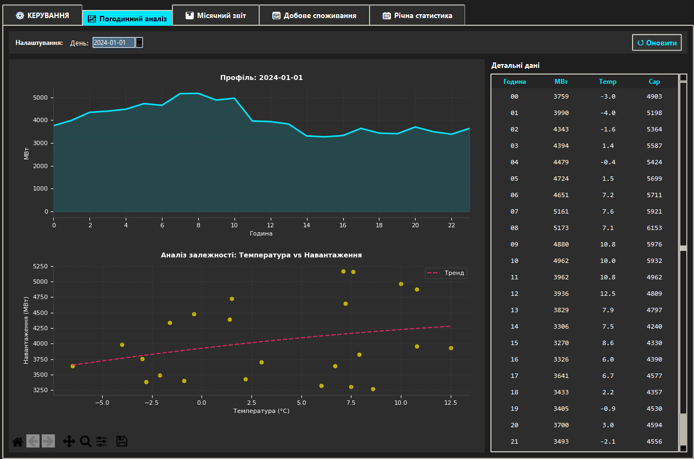

# PowerLoadAnalysisApp ⚡


**Професійна система моделювання та інтелектуального аналізу навантаження енергосистеми (Energy Monitor Pro).**

Цей додаток розроблено для генерації високоточних синтетичних даних споживання електроенергії та їх глибокого аналізу за допомогою методів Data Science.


*(Головна панель керування та генерації даних)*

## 📖 Про проєкт

**PowerLoadAnalysisApp** — це настільний додаток (Desktop GUI), який імітує роботу SCADA-системи. Він дозволяє моделювати споживання електроенергії з урахуванням:
* 🌡️ **Погодних умов** (температурна залежність).
* 📅 **Календарних факторів** (сезонність, свята, вихідні).
* 📈 **Економічних трендів** (річний ріст споживання).
* ⚠️ **Стохастичних аномалій** (імітація аварій та викидів).

## 🚀 Ключові можливості

### 1. Генерація даних (`Simulation Engine`)
Ядро системи використовує векторизацію **NumPy** для миттєвої генерації даних за 10+ років.
* **Режим "Стандарт" (Seed 42):** Гарантує повну відтворюваність результатів для наукових звітів.
* **Режим "Випадковий":** Генерує унікальні сценарії для стрес-тестування системи.

### 2. Аналітичний модуль (BI Dashboard)
Інтерфейс включає професійні інструменти візуалізації (**Matplotlib**) та навігації (Zoom/Pan):

* **📈 Погодинний аналіз:** Детальний розгляд профілю навантаження з кореляційним аналізом (Scatter Plot: Температура vs Споживання).
  

* **📊 Місячний моніторинг:** Агрегація даних (Мін/Макс/Середнє) та аналіз волатильності системи (Stability Analysis).
  

* **📅 Добове споживання:** Гістограми споживання енергії за кожен день місяця для виявлення пікових днів.
  

* **📆 Річна статистика:** Аналіз довгострокових трендів та порівняння динаміки різних років на одному графіку (Year-over-Year).
  

### 3. Звітність (Reporting)
Система автоматично формує професійні звіти у форматі **Excel (.xlsx)**:
* Окремі аркуші для денної та місячної статистики.
* Автоматичне форматування та підбір ширини колонок.
* Логування всіх дій у файл `energy_system.log`.

## 🛠 Технології

* **Мова:** Python 3.10+
* **GUI:** Tkinter (Custom Dark Theme + Navigation Toolbar)
* **Core:** Pandas, NumPy
* **Plotting:** Matplotlib (Embedded)
* **Export:** OpenPyXL

## 📂 Структура проєкту

```text
PowerLoadAnalysisApp/
├── main.py              # Точка входу (App Entry Point)
├── logic.py             # Ядро генерації та експорту (Business Logic)
├── plotting.py          # Візуалізація та стилізація графіків
├── ui_generation.py     # UI вкладки налаштувань
├── ui_analysis.py       # UI вкладок аналітики
├── requirements.txt     # Залежності
└── results/             # Папка для звітів (Excel/Logs)
````

## 📦 Встановлення та запуск

1.  **Клонуйте репозиторій:**

    ```bash
    git clone [https://github.com/RomanSapsay/PowerLoadAnalysisApp.git](https://github.com/RomanSapsay/PowerLoadAnalysisApp.git)
    cd PowerLoadAnalysisApp
    ```

2.  **Встановіть бібліотеки:**

    ```bash
    pip install -r requirements.txt
    ```

3.  **Запустіть додаток:**

    ```bash
    python main.py
    ```

## 👥 Автори

Проєкт"Система моніторингу завантаженості енергосистеми".

  * **Литвиненко Дмитро**
  * **Сапсай Роман**

-----

*2025 © PowerLoadAnalysisApp*
